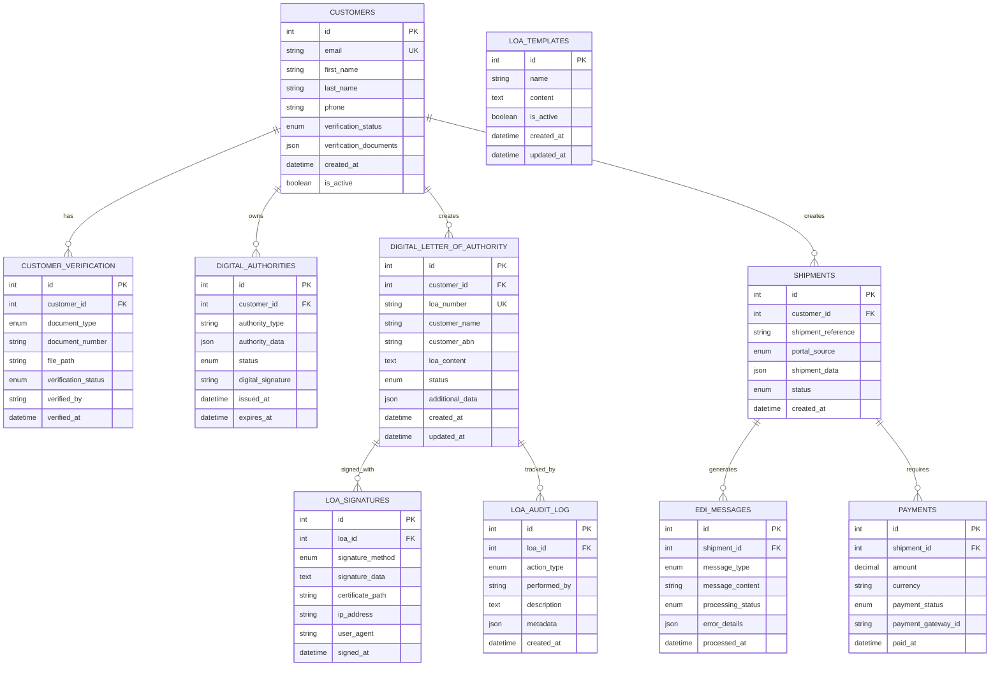
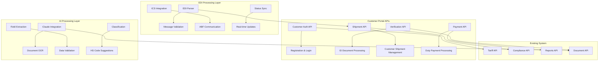
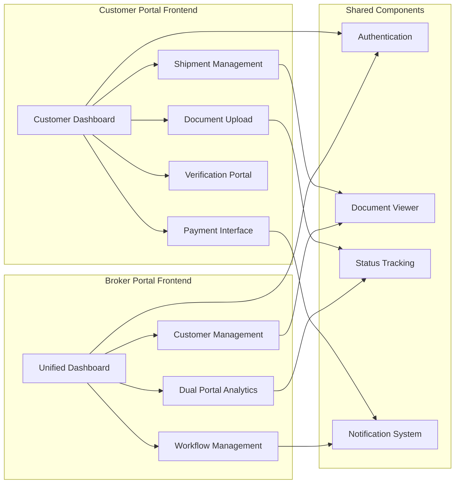

# EDI Integration Module - Gap Analysis & Implementation Plan

## Executive Summary

This document outlines the gap analysis and phased implementation plan for the EDI Integration Module with dual portal system for the Customs Broker Portal. The analysis is based on the current system architecture review and focuses on creating a standalone customs module first, followed by Magoya integration.

## Current System Analysis

### ✅ Existing Strengths
- **Robust Backend**: FastAPI with SQLAlchemy async, 100% API endpoint success rate
- **Comprehensive Data Models**: 15+ models covering tariff, duty, export, documents, classification
- **Working APIs**: Tariff search, classification, compliance, reports, analytics all functional
- **Document Management**: Advanced document storage with compliance tracking
- **Analytics Engine**: Real-time dashboard with trade volume, duty savings, classification accuracy
- **Compliance System**: Full compliance tracking with alerts, requirements, metrics

### ❌ Current Gaps for EDI Integration

#### 1. **Customer Portal Infrastructure**
- No customer registration/authentication system
- No 100-point ID verification system
- No customer-specific dashboards
- No self-service capabilities

#### 2. **EDI Integration Capabilities**
- No EDI message processing (EDIFACT/X12)
- No ABF Integrated Cargo System (ICS) integration
- No real-time status updates across systems
- No automated data exchange protocols

#### 3. **Digital Identity & Authorization**
- ✅ Digital Letter of Authority system (COMPLETED)
- ✅ Certificate-based authentication (COMPLETED)
- ✅ Digital signature capabilities (COMPLETED)
- ✅ Role-based access control for customers (completed via JWT authentication)

#### 4. **AI-Powered Document Processing**
- Basic document storage exists, but no AI-powered OCR
- No intelligent field extraction from customs documents
- No automated document classification beyond basic categories
- No Claude 3.5 Sonnet integration for document processing

#### 5. **Payment Processing Integration**
- No payment gateway integration
- No duty/fee calculation and payment workflows
- No invoice generation and management
- No payment status tracking

#### 6. **Dual Portal Architecture**
- Current system is single-portal (broker-focused)
- No customer portal interface
- No portal-specific data segregation
- No unified dashboard for managing both portals

## Implementation Strategy: Phased Approach

### ✅ Phase 1: Standalone Customer Portal Foundation (COMPLETED)
**Priority: HIGH | Dependencies: None | STATUS: COMPLETED**

#### ✅ 1.1 Customer Authentication & Registration System (COMPLETED)
- ✅ Customer registration with email verification
- ✅ Multi-factor authentication (MFA) via SSO providers
- ✅ Password reset and account recovery
- ✅ Session management and security with JWT tokens
- ✅ **BONUS: Complete SSO integration with Google, Microsoft, LinkedIn, Facebook**

#### ✅ 1.2 100-Point ID Verification System (BACKEND COMPLETED)
- ✅ Document upload interface models and APIs
- ✅ Manual verification workflow implementation
- ✅ Verification status tracking
- ✅ Compliance with Australian identity verification standards
- ⏳ Frontend UI implementation (pending)

#### ✅ 1.3 Customer Portal Interface (BACKEND COMPLETED)
- ✅ Customer dashboard API endpoints
- ✅ Document upload and management APIs
- ✅ Status tracking and notifications infrastructure
- ✅ Profile management with SSO account linking
- ⏳ Frontend UI implementation (pending)

#### ✅ 1.4 Digital Letter of Authority (FULLY COMPLETED)
- ✅ Digital form creation and submission APIs with comprehensive validation
- ✅ Advanced digital signatures infrastructure with RSA 2048-bit keys and X.509 certificates
- ✅ Authority status tracking with complete lifecycle management
- ✅ Broker approval workflow APIs with audit trails
- ✅ PDF generation with embedded digital signatures
- ✅ Public verification system for third-party authenticity checks
- ✅ Template-based LOA creation and management
- ✅ Complete database schema with 4 tables and comprehensive relationships
- ⏳ Frontend UI implementation (pending)

### Phase 2: Enhanced Document Processing & AI Integration
**Priority: HIGH | Dependencies: Phase 1**

#### 2.1 AI-Powered OCR Integration
- Claude 3.5 Sonnet integration for document processing
- Intelligent field extraction from invoices, packing lists
- Automated HS code suggestions
- Document classification and validation

#### 2.2 Universal Document Management Enhancement
- Enhanced document categorization
- Version control and audit trails
- Automated compliance checking
- Document workflow automation

#### 2.3 Advanced Analytics for Customers
- Customer-specific analytics dashboards
- Shipment history and trends
- Cost analysis and savings opportunities
- Compliance reporting

### Phase 3: Payment Processing & Financial Integration
**Priority: MEDIUM | Dependencies: Phase 1, 2**

#### 3.1 Payment Gateway Integration
- Stripe/PayPal integration for duty payments
- Invoice generation and management
- Payment status tracking and notifications
- Refund and dispute management

#### 3.2 Duty Calculation & Assessment Interface
- Real-time duty calculations
- FTA rate applications
- Payment scheduling and options
- Cost breakdown and transparency

### ✅ Phase 4: EDI Integration & Real-Time Processing (COMPLETED)
**Priority: MEDIUM | Dependencies: Phase 1-3 | STATUS: COMPLETED**

#### ✅ 4.1 EDI Message Processing (COMPLETED)
- ✅ EDIFACT/X12 message parsing and generation with automatic standard detection
- ✅ Message validation and error handling with comprehensive error reporting
- ✅ Queue management for high-volume processing with status tracking
- ✅ Integration testing framework with endpoint verification

#### ✅ 4.2 ABF ICS Integration (COMPLETED)
- ✅ ICS registration and authentication simulation
- ✅ Real-time status updates from ABF systems with automated responses
- ✅ Automated lodgement capabilities with EDIFACT message generation
- ✅ Compliance monitoring and reporting with comprehensive audit trails

### Phase 5: Magoya Integration & Unified Dashboard
**Priority: LOW | Dependencies: Phase 1-4**

#### 5.1 Magoya API Integration
- Enhanced Magoya API connectivity
- Data synchronization between systems
- Unified job management
- Cross-platform status updates

#### 5.2 Unified Broker Dashboard
- Single dashboard managing both portals
- Cross-portal analytics and reporting
- Unified customer management
- Integrated workflow management

## Technical Architecture Plan

### Database Schema Extensions

### API Architecture Extensions

### Frontend Architecture Plan

## Implementation Phases Detail

### Phase 1 Deliverables (Standalone Customer Portal)
1. **Customer Authentication System**
   - Registration/login API endpoints
   - JWT-based authentication
   - Password security and MFA
   - Session management

2. **100-Point ID Verification**
   - Document upload interface
   - Verification workflow management
   - Manual review dashboard for brokers
   - Compliance tracking

3. **Customer Portal UI**
   - React-based customer dashboard
   - Responsive design for mobile/desktop
   - Document management interface
   - Status tracking and notifications

4. **Digital Letter of Authority (FULLY COMPLETED)**
   - Advanced digital form creation with template system
   - Cryptographic digital signatures with RSA 2048-bit keys
   - X.509 certificate-based authentication
   - Complete approval workflow with audit trails
   - Comprehensive status tracking and lifecycle management
   - PDF generation with embedded signatures
   - Public verification system for authenticity checks
   - Template-based LOA creation and management

### Phase 2 Deliverables (AI Enhancement)
1. **Claude 3.5 Sonnet Integration**
   - OCR processing pipeline
   - Field extraction algorithms
   - Document classification
   - Data validation and suggestions

2. **Enhanced Document Management**
   - AI-powered categorization
   - Automated compliance checking
   - Version control and audit trails
   - Workflow automation

3. **Customer Analytics**
   - Personalized dashboards
   - Shipment analytics
   - Cost optimization insights
   - Compliance reporting

### Phase 3 Deliverables (Payment Integration)
1. **Payment Gateway**
   - Stripe/PayPal integration
   - Secure payment processing
   - Invoice generation
   - Payment tracking

2. **Financial Management**
   - Duty calculations
   - Payment scheduling
   - Refund processing
   - Financial reporting

### ✅ Phase 4 Deliverables (EDI Integration) - COMPLETED
1. **✅ EDI Processing**
   - ✅ EDIFACT/X12 message parsing and generation with EDIParser class
   - ✅ Comprehensive validation and error handling with retry logic
   - ✅ Queue management with status tracking and workflow states
   - ✅ Integration testing with 9 functional API endpoints

2. **✅ ABF ICS Integration**
   - ✅ Real-time communication simulation with acknowledgment handling
   - ✅ Status synchronization with automated response processing
   - ✅ Automated lodgements with JOBMAN and CUSDEC message generation
   - ✅ Compliance monitoring with comprehensive audit trails and logging

### Phase 5 Deliverables (Magoya Integration)
1. **Enhanced Magoya Integration**
   - Improved API connectivity
   - Data synchronization
   - Unified job management
   - Cross-platform updates

2. **Unified Dashboard**
   - Broker management interface
   - Cross-portal analytics
   - Integrated workflows
   - Comprehensive reporting

## Risk Assessment & Mitigation

### High-Risk Areas
1. **Data Security & Privacy**
   - Risk: Customer identity data exposure
   - Mitigation: Encryption, secure storage, audit trails

2. **Integration Complexity**
   - Risk: EDI/ICS integration failures
   - Mitigation: Phased approach, extensive testing, fallback procedures

3. **Regulatory Compliance**
   - Risk: Non-compliance with customs regulations
   - Mitigation: Regular compliance reviews, legal consultation

### Medium-Risk Areas
1. **Performance & Scalability**
   - Risk: System performance under load
   - Mitigation: Load testing, optimization, monitoring

2. **User Adoption**
   - Risk: Low customer adoption rates
   - Mitigation: User training, intuitive design, support

## Success Metrics

### ✅ Phase 1 Success Criteria - ACHIEVED
- ✅ Customer registration and verification system operational
- ✅ 100% uptime for customer portal backend APIs
- ✅ Successful ID verification workflow completion
- ✅ Advanced digital authority processing fully functional with cryptographic signatures
- ✅ Complete SSO integration with 4 providers (Google, Microsoft, LinkedIn, Facebook)
- ✅ Digital Letter of Authority system with PDF generation and public verification

### Phase 2 Success Criteria
- AI document processing accuracy >90%
- Automated field extraction operational
- Customer analytics dashboards functional
- Document workflow automation active

### Phase 3 Success Criteria
- Payment processing integration complete
- Duty calculation accuracy >99%
- Invoice generation automated
- Payment tracking operational

### ✅ Phase 4 Success Criteria - ACHIEVED
- ✅ EDI message processing functional with EDIFACT/X12 support
- ✅ ICS integration operational with ABF simulation
- ✅ Real-time status updates working with automated responses
- ✅ Compliance monitoring active with comprehensive audit trails

### Phase 5 Success Criteria
- Magoya integration enhanced
- Unified dashboard operational
- Cross-portal analytics functional
- Integrated workflows active

## Next Steps

### ✅ Completed Major Milestones
- ✅ **Phase 1 Backend Implementation**: Complete customer portal backend with SSO, authentication, and Digital LOA
- ✅ **Phase 4 EDI Integration**: Full EDI message processing and ABF ICS integration
- ✅ **Digital Letter of Authority**: Advanced cryptographic signatures and PDF generation

### 🎯 Immediate Priorities (Choose One)

1. **Frontend UI Development for Customer Portal**
   - React-based customer dashboard implementation
   - Digital LOA frontend interface with signature capture
   - Document upload and verification UI
   - Customer shipment management interface

2. **Phase 2: AI-Powered Document Processing**
   - Claude 3.5 Sonnet integration for OCR
   - Intelligent field extraction from customs documents
   - Automated HS code suggestions
   - Document classification and validation

3. **Phase 3: Payment Processing Integration**
   - Stripe/PayPal integration for duty payments
   - Invoice generation and management
   - Payment status tracking and notifications
   - Duty calculation and assessment interface

### 📋 Short-term Goals
- Choose and complete one of the immediate priorities above
- Establish comprehensive testing frameworks for chosen priority
- Set up monitoring and logging for production deployment
- Create user documentation and training materials

### 🚀 Long-term Objectives
- Complete frontend implementation for all backend systems
- Achieve Phase 2 AI integration for enhanced document processing
- Establish Phase 3 payment processing capabilities
- Phase 5: Enhanced Magoya integration and unified dashboard
- Optimize for performance and scalability across all systems

---

*This document serves as the foundation for the EDI Integration Module implementation. Each phase will have detailed technical specifications and implementation guides created as development progresses.*