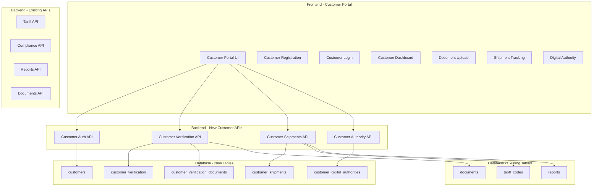
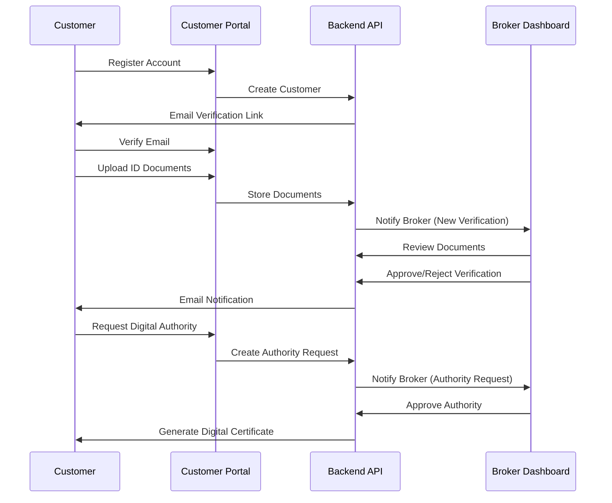

# Phase 1: Standalone Customer Portal Implementation Plan

## 🎯 **Objective**
Create a standalone customer portal with manual 100-point ID verification, customer authentication, and basic digital Letter of Authority capabilities.

## 📋 **Core Requirements**

### 1. Customer Authentication System
- **Customer Registration**: Email/password with verification
- **Login/Logout**: Secure session management
- **Profile Management**: Customer details and preferences
- **Password Reset**: Email-based password recovery

### 2. Manual 100-Point ID Verification
- **Document Upload**: Support for driver's license, passport, utility bills, etc.
- **Verification Workflow**: Broker manual review and approval process
- **Status Tracking**: Pending, approved, rejected, requires additional documents
- **Document Categories**: Primary ID (70 points), Secondary ID (40 points), Address verification (25 points)

### 3. Customer Portal Interface
- **Dashboard**: Verification status, shipment overview, recent activity
- **Document Management**: Upload, view, and manage verification documents
- **Shipment Tracking**: View customs clearance progress
- **Digital Authority**: Request and manage Letter of Authority

### 4. Basic Digital Letter of Authority
- **Authority Requests**: Customer can request digital authority
- **Broker Approval**: Manual approval workflow for brokers
- **Digital Certificates**: Generate PDF certificates with digital signatures
- **Authority Management**: View active authorities and expiration dates

## 🏗️ **Technical Architecture**



## 📊 **Database Schema Extensions**

### New Tables Required

#### 1. `customers` Table
```sql
CREATE TABLE customers (
    id UUID PRIMARY KEY DEFAULT gen_random_uuid(),
    email VARCHAR(255) UNIQUE NOT NULL,
    password_hash VARCHAR(255) NOT NULL,
    first_name VARCHAR(100) NOT NULL,
    last_name VARCHAR(100) NOT NULL,
    phone VARCHAR(20),
    company_name VARCHAR(255),
    abn VARCHAR(11),
    address_line1 VARCHAR(255),
    address_line2 VARCHAR(255),
    city VARCHAR(100),
    state VARCHAR(50),
    postcode VARCHAR(10),
    country VARCHAR(100) DEFAULT 'Australia',
    verification_status VARCHAR(20) DEFAULT 'pending',
    verification_points INTEGER DEFAULT 0,
    is_active BOOLEAN DEFAULT true,
    email_verified BOOLEAN DEFAULT false,
    created_at TIMESTAMP DEFAULT CURRENT_TIMESTAMP,
    updated_at TIMESTAMP DEFAULT CURRENT_TIMESTAMP
);
```

#### 2. `customer_verification` Table
```sql
CREATE TABLE customer_verification (
    id UUID PRIMARY KEY DEFAULT gen_random_uuid(),
    customer_id UUID REFERENCES customers(id) ON DELETE CASCADE,
    verification_type VARCHAR(50) NOT NULL, -- 'primary_id', 'secondary_id', 'address_proof'
    document_type VARCHAR(50) NOT NULL, -- 'drivers_license', 'passport', 'utility_bill', etc.
    points_value INTEGER NOT NULL,
    status VARCHAR(20) DEFAULT 'pending', -- 'pending', 'approved', 'rejected'
    reviewed_by UUID, -- Reference to broker/admin user
    reviewed_at TIMESTAMP,
    rejection_reason TEXT,
    notes TEXT,
    created_at TIMESTAMP DEFAULT CURRENT_TIMESTAMP,
    updated_at TIMESTAMP DEFAULT CURRENT_TIMESTAMP
);
```

#### 3. `customer_verification_documents` Table
```sql
CREATE TABLE customer_verification_documents (
    id UUID PRIMARY KEY DEFAULT gen_random_uuid(),
    verification_id UUID REFERENCES customer_verification(id) ON DELETE CASCADE,
    document_id UUID REFERENCES documents(id) ON DELETE CASCADE,
    document_side VARCHAR(20), -- 'front', 'back', 'single'
    created_at TIMESTAMP DEFAULT CURRENT_TIMESTAMP
);
```

#### 4. `customer_shipments` Table
```sql
CREATE TABLE customer_shipments (
    id UUID PRIMARY KEY DEFAULT gen_random_uuid(),
    customer_id UUID REFERENCES customers(id) ON DELETE CASCADE,
    shipment_reference VARCHAR(100) NOT NULL,
    description TEXT,
    origin_country VARCHAR(100),
    destination_country VARCHAR(100) DEFAULT 'Australia',
    value_aud DECIMAL(12,2),
    currency VARCHAR(3) DEFAULT 'AUD',
    hs_code VARCHAR(20),
    tariff_id UUID REFERENCES tariff_codes(id),
    status VARCHAR(50) DEFAULT 'pending', -- 'pending', 'processing', 'cleared', 'held'
    duty_amount DECIMAL(10,2),
    gst_amount DECIMAL(10,2),
    total_charges DECIMAL(10,2),
    estimated_clearance_date DATE,
    actual_clearance_date DATE,
    created_at TIMESTAMP DEFAULT CURRENT_TIMESTAMP,
    updated_at TIMESTAMP DEFAULT CURRENT_TIMESTAMP
);
```

#### 5. `customer_digital_authorities` Table
```sql
CREATE TABLE customer_digital_authorities (
    id UUID PRIMARY KEY DEFAULT gen_random_uuid(),
    customer_id UUID REFERENCES customers(id) ON DELETE CASCADE,
    authority_type VARCHAR(50) NOT NULL, -- 'general', 'specific_shipment', 'ongoing'
    scope_description TEXT NOT NULL,
    status VARCHAR(20) DEFAULT 'pending', -- 'pending', 'approved', 'active', 'expired', 'revoked'
    approved_by UUID, -- Reference to broker/admin user
    approved_at TIMESTAMP,
    valid_from DATE,
    valid_until DATE,
    certificate_path VARCHAR(500), -- Path to generated PDF certificate
    digital_signature_hash VARCHAR(255),
    terms_accepted BOOLEAN DEFAULT false,
    terms_accepted_at TIMESTAMP,
    created_at TIMESTAMP DEFAULT CURRENT_TIMESTAMP,
    updated_at TIMESTAMP DEFAULT CURRENT_TIMESTAMP
);
```

## 🔧 **Implementation Components**

### 1. Backend Models (SQLAlchemy)

#### Customer Model
```python
# backend/models/customer.py
from sqlalchemy import Column, String, Boolean, Integer, DateTime, Text, Decimal
from sqlalchemy.dialects.postgresql import UUID
from sqlalchemy.orm import relationship
from .base import Base
import uuid
from datetime import datetime

class Customer(Base):
    __tablename__ = "customers"
    
    id = Column(UUID(as_uuid=True), primary_key=True, default=uuid.uuid4)
    email = Column(String(255), unique=True, nullable=False, index=True)
    password_hash = Column(String(255), nullable=False)
    first_name = Column(String(100), nullable=False)
    last_name = Column(String(100), nullable=False)
    phone = Column(String(20))
    company_name = Column(String(255))
    abn = Column(String(11))
    address_line1 = Column(String(255))
    address_line2 = Column(String(255))
    city = Column(String(100))
    state = Column(String(50))
    postcode = Column(String(10))
    country = Column(String(100), default="Australia")
    verification_status = Column(String(20), default="pending")
    verification_points = Column(Integer, default=0)
    is_active = Column(Boolean, default=True)
    email_verified = Column(Boolean, default=False)
    created_at = Column(DateTime, default=datetime.utcnow)
    updated_at = Column(DateTime, default=datetime.utcnow, onupdate=datetime.utcnow)
    
    # Relationships
    verifications = relationship("CustomerVerification", back_populates="customer")
    shipments = relationship("CustomerShipment", back_populates="customer")
    digital_authorities = relationship("CustomerDigitalAuthority", back_populates="customer")
    
    @property
    def full_name(self):
        return f"{self.first_name} {self.last_name}"
    
    @property
    def is_verified(self):
        return self.verification_status == "approved" and self.verification_points >= 100
```

### 2. API Routes Structure

#### Customer Authentication Routes
```python
# backend/routes/customer_auth.py
from fastapi import APIRouter, Depends, HTTPException, status
from fastapi.security import HTTPBearer
from sqlalchemy.ext.asyncio import AsyncSession
from ..database import get_async_session
from ..models.customer import Customer
from ..schemas.customer import CustomerCreate, CustomerLogin, CustomerResponse

router = APIRouter(prefix="/api/customer/auth", tags=["Customer Authentication"])

@router.post("/register", response_model=CustomerResponse)
async def register_customer(customer_data: CustomerCreate, db: AsyncSession = Depends(get_async_session)):
    """Register a new customer"""
    pass

@router.post("/login")
async def login_customer(login_data: CustomerLogin, db: AsyncSession = Depends(get_async_session)):
    """Customer login"""
    pass

@router.post("/logout")
async def logout_customer():
    """Customer logout"""
    pass

@router.get("/profile", response_model=CustomerResponse)
async def get_customer_profile(current_customer: Customer = Depends(get_current_customer)):
    """Get customer profile"""
    pass
```

#### Customer Verification Routes
```python
# backend/routes/customer_verification.py
from fastapi import APIRouter, Depends, UploadFile, File
from sqlalchemy.ext.asyncio import AsyncSession
from ..database import get_async_session
from ..models.customer import Customer

router = APIRouter(prefix="/api/customer/verification", tags=["Customer Verification"])

@router.get("/status")
async def get_verification_status(current_customer: Customer = Depends(get_current_customer)):
    """Get customer verification status"""
    pass

@router.post("/upload-document")
async def upload_verification_document(
    verification_type: str,
    document_type: str,
    file: UploadFile = File(...),
    current_customer: Customer = Depends(get_current_customer)
):
    """Upload verification document"""
    pass

@router.get("/documents")
async def get_verification_documents(current_customer: Customer = Depends(get_current_customer)):
    """Get customer verification documents"""
    pass
```

### 3. Frontend Components Structure

#### Customer Portal Layout
```typescript
// frontend/src/components/customer/CustomerLayout.tsx
import React from 'react';
import { Outlet } from 'react-router-dom';
import CustomerNavbar from './CustomerNavbar';
import CustomerSidebar from './CustomerSidebar';

const CustomerLayout: React.FC = () => {
  return (
    <div className="min-h-screen bg-gray-50">
      <CustomerNavbar />
      <div className="flex">
        <CustomerSidebar />
        <main className="flex-1 p-6">
          <Outlet />
        </main>
      </div>
    </div>
  );
};

export default CustomerLayout;
```

#### Customer Dashboard
```typescript
// frontend/src/pages/customer/Dashboard.tsx
import React from 'react';
import VerificationStatus from '../components/VerificationStatus';
import ShipmentSummary from '../components/ShipmentSummary';
import RecentActivity from '../components/RecentActivity';

const CustomerDashboard: React.FC = () => {
  return (
    <div className="space-y-6">
      <h1 className="text-2xl font-bold text-gray-900">Dashboard</h1>
      
      <div className="grid grid-cols-1 lg:grid-cols-3 gap-6">
        <div className="lg:col-span-2">
          <VerificationStatus />
          <ShipmentSummary />
        </div>
        <div>
          <RecentActivity />
        </div>
      </div>
    </div>
  );
};

export default CustomerDashboard;
```

## 🔐 **Security Implementation**

### 1. Authentication & Authorization
- **JWT Tokens**: Secure customer session management
- **Password Hashing**: bcrypt for password security
- **Email Verification**: Confirm customer email addresses
- **Session Management**: Secure token refresh and logout

### 2. Document Security
- **File Upload Validation**: Restrict file types and sizes
- **Secure Storage**: Encrypted document storage
- **Access Control**: Customers can only access their own documents
- **Audit Trail**: Track all document access and modifications

### 3. Data Protection
- **Input Validation**: Comprehensive request validation
- **SQL Injection Prevention**: Parameterized queries
- **CORS Configuration**: Restrict cross-origin requests
- **Rate Limiting**: Prevent abuse of API endpoints

## 📱 **User Experience Flow**

### Customer Registration & Verification Flow


## 🎯 **Success Metrics**

### Phase 1 Completion Criteria
- ✅ **Customer Registration**: Working signup and email verification
- ✅ **Authentication**: Secure login/logout with JWT tokens
- ✅ **Document Upload**: Support for multiple ID document types
- ✅ **Manual Verification**: Broker workflow for document review
- ✅ **100-Point System**: Accurate point calculation and tracking
- ✅ **Customer Dashboard**: Comprehensive status overview
- ✅ **Digital Authority**: Basic certificate generation and management
- ✅ **Integration**: Seamless connection with existing tariff/compliance APIs

### Key Performance Indicators
- **Registration Completion Rate**: >90% of started registrations completed
- **Verification Processing Time**: <48 hours for document review
- **Customer Satisfaction**: >4.5/5 rating for portal usability
- **Security Compliance**: Zero security incidents during Phase 1

## 🔄 **Integration with Existing System**

### Leveraging Current APIs
- **Tariff Classification**: Use existing [`/api/tariff/search`](backend/routes/tariff.py:45) for HS code lookups
- **Compliance Checking**: Integrate with [`/api/compliance/overview`](backend/routes/compliance.py:35) for shipment compliance
- **Document Storage**: Extend existing [`Document`](backend/models/documents.py:67) model for verification documents
- **Reporting**: Use [`/api/reports/analytics`](backend/routes/reports.py:156) for customer analytics

### Database Integration
- **Foreign Keys**: Link customer shipments to existing tariff codes
- **Document Relationships**: Connect verification documents to existing document management
- **Audit Trail**: Extend existing audit logging for customer actions
- **Data Consistency**: Maintain referential integrity across all tables

## 📋 **Implementation Checklist**

### ✅ Backend Development (COMPLETED)
- [x] Create customer authentication models and schemas
- [x] Implement JWT-based authentication system with SSO support
- [x] Build customer verification workflow APIs
- [x] Create customer shipment tracking endpoints
- [x] Implement digital authority management
- [x] Add comprehensive error handling
- [x] Create database migration scripts
- [x] **BONUS: Complete SSO integration with 4 providers (Google, Microsoft, LinkedIn, Facebook)**
- [x] **BONUS: Provider Factory Pattern for extensible SSO architecture**
- [x] **BONUS: Token encryption and secure session management**
- [ ] Add email notification system (pending)
- [ ] Create broker approval workflows (pending)
- [ ] Implement file upload and validation (pending)

### ⏳ Frontend Development (IN PROGRESS)
- [ ] Design customer portal UI/UX
- [ ] Implement customer registration flow
- [ ] Build authentication components with SSO integration
- [ ] Create document upload interface
- [ ] Design verification status dashboard
- [ ] Implement shipment tracking views
- [ ] Build digital authority management
- [ ] Add responsive design for mobile
- [ ] Implement error handling and loading states
- [ ] Create customer help documentation

### ⏳ Testing & Quality Assurance (PENDING)
- [ ] Unit tests for all API endpoints
- [ ] Integration tests for authentication flow
- [ ] End-to-end testing for verification process
- [ ] Security testing for file uploads
- [ ] Performance testing for document processing
- [ ] User acceptance testing with sample customers
- [ ] Browser compatibility testing
- [ ] Mobile responsiveness testing
- [ ] **SSO provider testing across all 4 platforms**

### ⏳ Deployment & Configuration (PENDING)
- [ ] Environment configuration for customer portal
- [ ] SSL certificate setup for secure communications
- [ ] Email service configuration (SMTP/SendGrid)
- [ ] File storage configuration (local/cloud)
- [x] Database migration deployment (completed)
- [ ] Monitoring and logging setup
- [ ] Backup and recovery procedures
- [ ] Documentation for system administrators
- [ ] **OAuth app registration with production credentials**

## 🚀 **Next Steps After Phase 1**

Upon successful completion of Phase 1, the system will be ready for:

1. **Phase 2**: AI-powered document processing with Claude 3.5 Sonnet
2. **Phase 3**: Payment processing integration for duty payments
3. **Phase 4**: EDI integration with ABF's Integrated Cargo System
4. **Phase 5**: Enhanced Magoya integration and unified broker dashboard

The standalone customer portal will provide a solid foundation for all subsequent phases while delivering immediate value to customers through streamlined verification and shipment tracking capabilities.