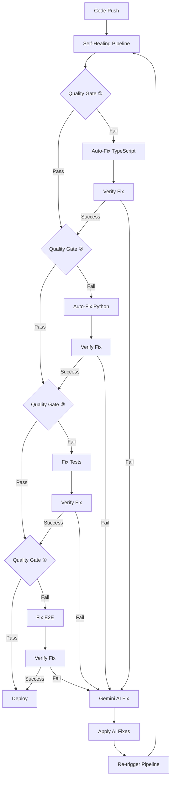

# 🤖 Self-Healing CI/CD Pipeline Guide

## Overview

This project implements a sophisticated self-healing CI/CD pipeline that automatically detects, diagnoses, and fixes common development issues using AI-powered automation. The system combines GitHub Actions, GitHub Copilot, and Google's Gemini AI to create a "hands-free, self-healing test → fix → re-test loop" that minimizes manual intervention.

## Architecture

### Core Components

1. **Self-Healing Pipeline** (`.github/workflows/self-healing-pipeline.yml`)
   - Primary CI/CD workflow with built-in auto-fix capabilities
   - Multiple quality gates with automatic retry logic
   - Integrated GitHub Copilot suggestions

2. **Gemini AI Auto-Fix** (`.github/workflows/gemini-auto-fix.yml`)
   - Advanced AI-powered issue resolution using Google's Gemini API
   - Sophisticated error analysis and fix generation
   - Automatic code application and verification

3. **Legacy Workflows** (Enhanced for compatibility)
   - `ci-cd.yml` - Original comprehensive pipeline
   - `claude-auto-fix.yml` - Issue creation for manual review
   - `deploy-to-digital-ocean.yml` - Production deployment

## Quality Gates

### 🎯 Quality Gate ① - Frontend TypeScript & Linting
- **Checks**: TypeScript compilation (`tsc -b`), ESLint linting
- **Auto-Fixes**: 
  - Missing imports (React, hooks, utilities)
  - Type definition corrections
  - Common TypeScript patterns
  - ESLint auto-fixable issues

### 🎯 Quality Gate ② - Backend Code Quality
- **Checks**: Black formatting, isort import sorting, mypy type checking, pytest
- **Auto-Fixes**:
  - Code formatting with Black
  - Import sorting with isort
  - Common type hint additions
  - Basic Python code patterns

### 🎯 Quality Gate ③ - Frontend Unit Tests
- **Checks**: Jest unit tests with coverage requirements
- **Auto-Fixes**: Test configuration updates, mock corrections

### 🎯 Quality Gate ④ - End-to-End Tests
- **Checks**: Playwright E2E tests across multiple browsers
- **Auto-Fixes**: Selector updates, timing adjustments

## AI-Powered Auto-Fixing

### GitHub Copilot Integration
- Automatic suggestions for TypeScript compilation errors
- Context-aware import and type fixes
- Integration with GitHub CLI for real-time assistance

### Gemini AI Advanced Fixing
- Comprehensive error log analysis
- Intelligent fix generation based on codebase context
- Multi-file change coordination
- Verification and testing of applied fixes

## Self-Healing Logic

### Retry Mechanism
```yaml
# Automatic retry up to 3 attempts
MAX_RETRY_ATTEMPTS: 3
```

### Fix Application Process
1. **Error Detection**: Parse workflow logs for specific error patterns
2. **AI Analysis**: Send errors to Gemini AI for fix generation
3. **Fix Application**: Apply generated fixes automatically
4. **Verification**: Re-run quality checks to verify fixes
5. **Commit & Push**: Automatically commit successful fixes
6. **Re-trigger**: Restart the pipeline to validate all fixes

### Safety Guards
- Maximum retry limit to prevent infinite loops
- Verification step before committing changes
- Rollback capability for failed fixes
- Human intervention triggers for complex issues

## Configuration

### Required Secrets
```bash
# GitHub Repository Secrets
GITHUB_TOKEN                 # Automatic (provided by GitHub)
GEMINI_API_KEY              # Google Gemini API key
DIGITALOCEAN_ACCESS_TOKEN   # For deployment
BOT_PAT                     # Personal Access Token for bot actions
```

### Environment Variables
```yaml
MAX_RETRY_ATTEMPTS: 3       # Maximum auto-fix attempts
CURRENT_ATTEMPT: 1          # Current attempt counter
```

## Testing Configuration

### Frontend Testing
- **Unit Tests**: Jest with React Testing Library
- **E2E Tests**: Playwright with multi-browser support
- **Coverage**: 70% minimum threshold
- **Mocking**: MSW for API mocking

### Backend Testing
- **Unit Tests**: pytest with asyncio support
- **Coverage**: 70% minimum threshold
- **Fixtures**: Database and API fixtures
- **Markers**: Categorized test types (unit, integration, slow)

## Usage

### Automatic Triggering
The self-healing pipeline automatically triggers on:
- Push to `main`, `master`, or `develop` branches
- Pull requests to protected branches
- Workflow failures (triggers Gemini AI auto-fix)

### Manual Triggering
```bash
# Trigger Gemini AI fix for specific issue
# Comment on any issue or PR:
@gemini-fix

# Or use GitHub CLI
gh workflow run self-healing-pipeline.yml
```

### Monitoring
- **GitHub Actions**: Monitor workflow runs and logs
- **Artifacts**: Download test results, coverage reports, fix logs
- **Issues**: Automatic issue creation for persistent failures

## Common Auto-Fixes

### TypeScript Issues
```typescript
// Before (Error)
import { useState } from 'react';  // Missing import
const [count, setCount] = useState(0);

// After (Auto-fixed)
import React, { useState } from 'react';
const [count, setCount] = useState<number>(0);
```

### Python Issues
```python
# Before (Error)
def calculate_total(items):
    return sum(items)

# After (Auto-fixed)
from typing import List

def calculate_total(items: List[float]) -> float:
    return sum(items)
```

### ESLint Issues
```javascript
// Before (Warning)
const unused_variable = 'test';
console.log('hello')

// After (Auto-fixed)
console.log('hello');
```

## Workflow Integration

### Pipeline Flow


### Deployment Integration
- Only deploys after ALL quality gates pass
- Automatic rollback on deployment failure
- Health checks and verification
- Blue-green deployment support

## Troubleshooting

### Common Issues

#### Pipeline Stuck in Retry Loop
```bash
# Check retry count
echo ${{ github.run_attempt }}

# Manual intervention required if > 3
```

#### Gemini API Rate Limits
```bash
# Check API quota
curl -H "Authorization: Bearer $GEMINI_API_KEY" \
     https://generativelanguage.googleapis.com/v1/models
```

#### Fix Application Failures
```bash
# Check fix logs
cat applied_fixes.log

# Review generated fixes
cat gemini_fixes.json
```

### Debug Mode
Enable verbose logging by setting:
```yaml
env:
  DEBUG: true
  VERBOSE_LOGGING: true
```

## Best Practices

### Code Organization
- Keep functions small and testable
- Use proper TypeScript types
- Follow consistent naming conventions
- Maintain good test coverage

### Pipeline Optimization
- Use caching for dependencies
- Parallelize independent jobs
- Optimize test execution time
- Monitor resource usage

### AI Fix Quality
- Review auto-generated fixes regularly
- Update fix patterns based on common issues
- Maintain business logic constraints
- Test fix effectiveness

## Metrics and Monitoring

### Success Metrics
- **Fix Success Rate**: Percentage of issues automatically resolved
- **Pipeline Duration**: Time from push to deployment
- **Manual Intervention**: Frequency of human intervention required
- **Test Coverage**: Maintained coverage levels

### Monitoring Dashboards
- GitHub Actions workflow status
- Test result trends
- Fix application success rates
- Deployment frequency and success

## Security Considerations

### API Key Management
- Store all API keys in GitHub Secrets
- Rotate keys regularly
- Use least-privilege access
- Monitor API usage

### Code Changes
- All auto-fixes are committed with clear messages
- Changes are traceable and auditable
- Rollback capability maintained
- Human review for sensitive changes

## Future Enhancements

### Planned Features
- Visual regression testing integration
- Performance benchmark automation
- Security vulnerability auto-fixing
- Multi-language support expansion

### AI Improvements
- Learning from fix success patterns
- Context-aware fix generation
- Integration with more AI providers
- Custom fix pattern training

## Support

### Getting Help
- Check workflow logs for detailed error information
- Review auto-generated fix reports
- Consult the troubleshooting section
- Create issues for persistent problems

### Contributing
- Submit fix pattern improvements
- Report false positives/negatives
- Suggest new auto-fix capabilities
- Contribute test cases

---

**Note**: This self-healing pipeline represents a cutting-edge approach to CI/CD automation. While it significantly reduces manual intervention, human oversight remains important for complex issues and business logic changes.